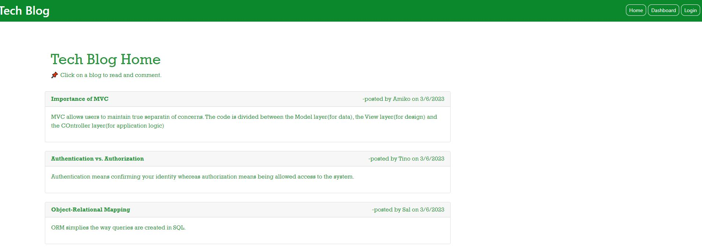

# Tech-Blog
Tech Blog is a CMS-style blog site which is build on MVC model and is deployed on Heroku. It uses, Node.js, Sequilize and ORM.

## Description
Tech Blog is a CMS-style blog site where developers can publish their blog posts and comment on other developers’ posts as well.  They also can update or delete their existing blogs.

Here are the main features of the application:

* When a user visits the site for the first time, they are presented with the homepage, which includes existing blog posts if any have been posted; navigation links for the homepage and the dashboard; and the option to log in
* When the user clicks on the homepage option, they are taken to the homepage
* When the user clicks on any other links in the navigation, they are prompted to either sign up or sign in
* When the user chooses to sign up, they are prompted to create a username and password
* When the user clicks on the sign-up button, their user credentials are saved and they are logged into the site
* When the user revisits the site at a later time and chooses to sign in, they are prompted to enter their username and password
* When a user is signed in to the site, they see navigation links for the homepage, the dashboard, and the option to log out
* When the user clicks on the homepage option in the navigation, they are taken to the homepage and presented with existing blog posts that include the post title and the date created
* When the user clicks on an existing blog post, they are presented with the post title, contents, post creator’s username, and date created for that post and have the option to leave a comment
* When the user enters a comment and click on the submit button while signed in, then the comment is saved and the post is updated to display the comment, the comment creator’s username, and the date created
* When the user clicks on the dashboard option in the navigation, they are taken to the dashboard and presented with any blog posts they have already created and the option to add a new blog post
* When the user clicks on the button to add a new blog post, they are prompted to enter both a title and contents for their blog post
* When the user clicks on the button to create a new blog post, then the title and contents of their post are saved and they are taken back to an updated dashboard with their new blog post
* When the user clicks on one of their existing posts in the dashboard, they are able to delete or update their post and taken back to an updated dashboard
* When the user clicks on the logout option in the navigation, they are signed out of the site
* When the user is idle on the site for more than a set time, they are able to view comments but they are prompted to log in again before they can add, update, or delete comments

## Technology Used

* Uses the [express package](https://www.npmjs.com/package/express)
* Uses the [mysql2 package](https://www.npmjs.com/package/mysql2) 
* Uses the [sequelize package](https://www.npmjs.com/package/sequelize) 
* Uses the [dotenv package](https://www.npmjs.com/package/dotenv) 
* Uses the [bcrypt](https://www.npmjs.com/package/bcrypt)


## Installation

  To install necessary dependencies, run the following command:
  ```
  npm i
  ```
  To install necessary database, run the following commands in mysql2 CLI:
  ```
  source db/schema.sql
  ```
  Create a .env file
  ```
  Rename the .env_EXAMPLE file to .env
  Add the database name, your username, and password for the MySQL server, the database host, and the port in the.env file
  ```
  To create the seed data, do the following steps:
  ```
  npm run seed
  ```
  Run the server using the following command:
  ```
  node server
  ```

## Schema Used

* Tables:
    * Blog
        * id
        * title
        * content
        * owner_id
        * date_created
    * Comment
        * id
        * content
        * owner_id
        * blog_id
        * date_created
    * User
        * id
        * name
        * email
        * password
* Relationships:
    * Blog belongs to owner (= user)
    * Blog has many comments
    * Comment belongs to owner(= user) and blog
    * A comment belongs to only one blog
    * A user can have many blogs and many comments

## Mock-Up

Demo of Project: [Tech Blog Demo on Google Drive](https://drive.google.com/file/d/1elgIvQZRddK0SVEt-_nSS--MRvpQrOBV/view?usp=sharing) 

Application Screenshot:



## Usage
1. You can access the file in GitHub repository: https://github.com/rbhumbla1/Tech-Blog 
2. Run the application in the terminal using this command: 
```
node server.js
```
3. You can access the application on Heroku: https://serene-fjord-12187.herokuapp.com/

## License
None

## Contributing

Contact owner

## Questions

  If you have any questions about the repository and project, or would like to open an issue or would like to contact me for contributing or any other subject, you can do so at rima.bhumbla@gmail.com. You can welcome to see more of my work at https://github.com/rbhumbla1.

